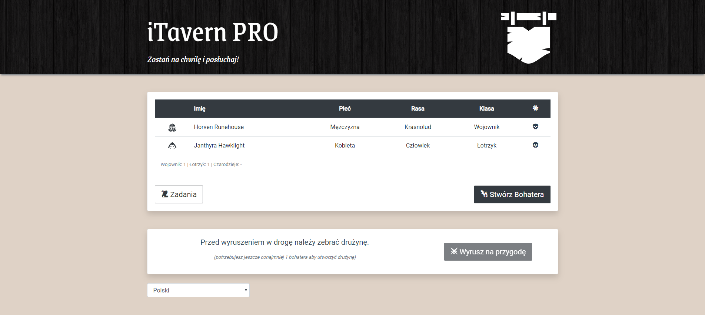

# iTavern PRO

Sample application prepared for Vue workshop.



## Requirements

- Node.js in version 8.9 or above
- Chrome or Firefox browser

## Setup

### Client:

1. Download starter template from repository:

   ```
   git clone git@github.com:rrozanski/i-tavern-pro.git
   ```
   or
   ```
   git clone https://github.com/rrozanski/i-tavern-pro.git
   ```
2. Install dependencies:

   ```
   npm install
   ```
3. Run application:

   ```
   npm run serve
   ```
4. Open browser on url shown by the CLI e.g.:

   ```
   http://localhost:8080/
   ```
   
### API:

1. Download API from repository:

   ```
   git clone git@github.com:rrozanski/i-tavern-pro-api.git
   ```
   or
   ```
   git clone https://github.com/rrozanski/i-tavern-pro-api.git
   ```
2. Install dependencies:

   ```
   npm install
   ```
3. Run API:

   ```
   node .\index.js
   ```

## Useful tools

- Suggested IDEs:
   - WebStorm
   - Visual Studio Code (with Vetur extension)

- Vue Devtools extension: [https://github.com/vuejs/vue-devtools](https://github.com/vuejs/vue-devtools)

## Source code for completed application

Source code for completed application is available on the branch:
```
completed-app
```

## Used assets
- Google Fonts:
  - Roboto: [https://fonts.google.com/specimen/Roboto](https://fonts.google.com/specimen/Roboto)
  - Grenze: [https://fonts.google.com/specimen/Grenze](https://fonts.google.com/specimen/Grenze)
- dark wood texture by Omar Alvarado: [https://www.toptal.com/designers/subtlepatterns/dark-wood/](https://www.toptal.com/designers/subtlepatterns/dark-wood/)
- RPG-Awesome icons: [http://nagoshiashumari.github.io/Rpg-Awesome/](http://nagoshiashumari.github.io/Rpg-Awesome/)
- SVG images:
  - hanging sign icon by Delapouite: [https://game-icons.net/1x1/delapouite/hanging-sign.html](https://game-icons.net/1x1/delapouite/hanging-sign.html)
  - dwarf helmet icon by Kier Heyl: [https://game-icons.net/1x1/kier-heyl/dwarf-helmet.html](https://game-icons.net/1x1/kier-heyl/dwarf-helmet.html)
  - hood icon by Lorc: [https://game-icons.net/1x1/lorc/hood.html](https://game-icons.net/1x1/lorc/hood.html)
  - wizard face icon by Delapouite: [https://game-icons.net/1x1/delapouite/wizard-face.html](https://game-icons.net/1x1/delapouite/wizard-face.html)
  - wizard face icon by Delapouite: [https://game-icons.net/1x1/delapouite/wizard-face.html](https://game-icons.net/1x1/delapouite/wizard-face.html)
  - spiked dragon head icon by Delapouite: [https://game-icons.net/1x1/delapouite/spiked-dragon-head.html](https://game-icons.net/1x1/delapouite/spiked-dragon-head.html)
